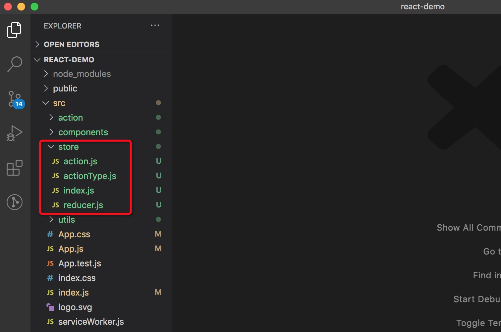

## 在React中使用Redux
前面的文章简单介绍了一下redux的实现原理，本篇文章主要介绍一下如何使用。话不多说，直接上代码。

### 项目结构
 

* 红色框里的内容就是redux相关的内容，因为只是个简单的例子，所以我将action、store、reducer、actionType都放在了一个目录下。如果是真正的开发中最好还是区分开好点。

### 代码实现
主要是在React中使用Redux实现给一个todolist添加数据，以及一个累加器
* **action.js**

```
    import actionType from './actionType';
    const {
        INCREMENT,
        REDUCE,
        DATA_LIST,
        ADD_TODO
    } = actionType;

    // 增加cout
    export const incrementAction = (count) => {
        return {type: INCREMENT, count};
    } 
    // 减少cout
    export const reduceAction = (count) => {
        return {type: REDUCE, count};
    }

    // 获取一个todo列表数据
    export const getTodoList = () => {
        return (dispatch) => {
            setTimeout(function(){
                let data = ['learning react', 'learning redux'] 
                dispatch({
                    type: DATA_LIST,
                    dataList: data
                })
            }, 1000)
        }
    }
    // 给todo列表里添加一条数据
    export const addTodo = (item) => {
        return (dispatch) => {
            setTimeout(function(){
                dispatch({
                    type: ADD_TODO,
                    todoItem: item
                })
            }, 1000)
        }
    }

```
* **actionType.js**

```
    // 所有的action的类型
    const actionType = {
        DATA_LIST: 'DATALIST',
        ADD_TODO: 'ADD_TODO',
    }
    export default actionType;
```
* **reducer.js**

```
    import actionType from './actionType';

    export default (state = {}, action) => {
        const newState = JSON.parse(JSON.stringify(state));
        switch(action.type) {
            case actionType.INCREMENT:
                newState.count = newState.count ? newState.count + action.count : action.count;
                return newState;
            case actionType.REDUCE:
                newState.count = newState.count ? newState.count - action.count : 0 - action.count;
                return newState;
            case actionType.DATA_LIST:
                return {dataList: action.dataList};
            case actionType.ADD_TODO:
                if (newState.dataList) {
                    newState.dataList.push(action.todoItem)
                } else {
                    newState.dataList = [action.todoItem]
                }
                return newState;
            default:
                return state;
        }
    }
```
* **index.js**

```
    import { createStore, compose, applyMiddleware} from "redux";
    import thunk from 'redux-thunk';
    import reducer from "./reducer";
    const composeEnhancers = window.__REDUX_DEVTOOLS_EXTENSION_COMPOSE__ ? 
    window.__REDUX_DEVTOOLS_EXTENSION_COMPOSE__({}) : compose;
    const enhancer = composeEnhancers(applyMiddleware(thunk));
    const store = createStore(reducer, enhancer);
    export default store;
```
* **在App.js使用**

```
import React from 'react';
import './App.css';
import { incrementAction, reduceAction, getTodoList, addTodo } from './store/action';
import { connect } from 'react-redux';

const mapStateToProps = (state) => {
  return {
    count: state.count,
    dataList: state.dataList,
  };
};

const mapDispatchToProps = (dispatch) => ({
  increment: (num) => dispatch(incrementAction(num)),
  decrement: (num = 1) => dispatch(reduceAction(num)),
  getTodoList: () => dispatch(getTodoList()),
  addTodo: (item) => dispatch(addTodo(item)),
});

connect(mapStateToProps, mapDispatchToProps)
class App extends React.Component {
  constructor(props) {
    super(props);
    this.state = {
      text: '',
    }
    this.getTodoList = props.getTodoList;
    this.addTodo = props.addTodo;
  }

  render() {
    const { dataList = [], count } = this.props;
    console.log('dataList', dataList)
    return (<div className='container'>
      <p onClick={() => this.props.increment(1)}>点击加+1</p>
      <p onClick={() => this.props.decrement(1)}>点击-1</p>
      <p>{count || 0}</p>
      <p onClick={this.props.getTodoList}>获取列表</p>
      <input
        value={this.state.text}
        className='input'
        onChange={this.inputChange} />
      <button
        onClick={() => this.addTodo(this.state.text)}
        className='button'>点击添加</button>
      {
        dataList.map((item, index) => (
          <div key={index}>
            {item}
          </div>
        ))
      }
    </div>)
  }

  componentDidMount() {
    this.getTodoList();
  }

  inputChange = (e) => {
    this.setState({ text: e.target.value })
  }
}
export default connect(mapStateToProps, mapDispatchToProps)(App);
```
